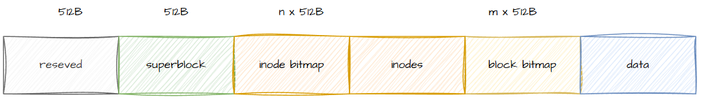

<h1 align="center">NumbFS</h1>


[](https://www.gnu.org/licenses/old-licenses/gpl-2.0.en.html)


NumbFS (**Numb** **F**ile **S**ystem) is a simple and easy-to-understand file system designed for educational purposes. It strips away the complex optimizations found in modern production-level file systems, clearly demonstrating the core workings of a file system. It serves as a starting point for learning about operating systems and storage systems.

### Table of Contents

- [Background](#background)
- [Related Work](#related-work)
- [Design of NumbFS](#design-of-numbfs)
- [Compilation & Installation](#compilation-and-installation)
- [Limitations](#limitations)
- [Contributing and License](#contributing-and-license)

<div id="background">

## Background

As the cornerstone of an operating system, the file system manages persistent data and hides the complexity of underlying block devices through intuitive abstractions such as files and directories. Gaining a deep understanding of how file systems work is crucial for mastering the core mechanisms of operating systems.

However, in pursuit of extreme performance, reliability, and support for diverse application scenarios, modern production-level file systems (such as ext4, XFS, ZFS, and Btrfs) have become exceptionally complex. They commonly incorporate advanced features such as journaling, copy-on-write, deduplication, compression, and encryption. While these features significantly enhance the overall capabilities of the systems, their architectural complexity has also greatly increased, causing the core mechanisms of data organization and management to become buried under layers of implementation details. For beginners, directly reading the source code of these systems is like confronting a towering peak—the steep learning curve can be daunting.

As the ancient saying goes, "He who would ascend to great heights must begin from the low ground; he who would travel far must begin from near." The same applies to learning about file systems. If one attempts to start by analyzing the most complex systems, the effort often yields half the results with double the effort. Instead, beginning with structurally clear and conceptually pure simple models allows for progressive learning—building a knowledge system step by step and truly grasping the essence of their design.

It is precisely in this context that the NumbFS project emerges. Designed as an educational "toy" file system focused on understanding, its goal is not to replace industrial-grade solutions but rather to strip away non-essential complexities and present the most fundamental components of a file system—core concepts such as inode management, data block allocation, and directory structure—in an intuitive manner. NumbFS aims to build a solid staircase for learners, enabling them to start from the fundamentals and progressively climb toward mastering the skills needed to conquer more advanced systems.

Meanwhile, on a personal level, developing NumbFS has been a highly valuable learning experience. By practically building a file system, I have gained a deeper and more concrete understanding of the collaborative mechanisms between the Virtual File System (VFS), Page Cache, and the I/O stack.

</div>

<div id="related-work">

## Related Work

The design philosophy and core implementation of NumbFS primarily draw inspiration from two types of file systems: simplified systems designed for education and classic disk file systems once widely used in Linux. These provide NumbFS with a clear design blueprint and a reliable proof-of-concept.

### The xv6 File System
xv6 is a teaching operating system widely used in modern operating system courses, and its file system design is the most important reference for NumbFS. The xv6 file system demonstrates the core architecture of a Unix-like file system with exceptional clarity, including:

- **Classic Disk Layout**: Clearly divides the disk into boot blocks, superblocks, inode bitmaps, data bitmaps, inode tables, and data block regions.

- **Simple and Intuitive Inode Structure**: Employs a combination of direct blocks and singly indirect indexing, perfectly illustrating the concept of multi-level indexing.

NumbFS fully embraces the xv6 file system’s philosophy of being "designed for clarity in teaching" and draws heavily from its disk structure and data layout.

### The ext2 File System
As one of the most successful and stable disk file systems in Linux history, ext2 is a real-world exemplar of "classic" disk file system design. It shares a similar design philosophy with the xv6 file system but operates at a larger scale with more complete functionality, serving as an essential stepping stone to modern file systems like ext3/ext4.

- **Industrial-Grade Robustness**: Its disk structure (superblocks, block group descriptors, bitmaps, inode tables) forms the foundation of many file system designs.

- **Comprehensive Features**: It supports essential modern file system characteristics, such as extended file attributes (xattr) and access control lists (ACLs), which are absent in minimal systems like xv6.

- **Clear Evolutionary Path**: Understanding ext2’s design allows for a smooth transition to its successors—ext3 (which added journaling) and ext4 (which introduced features like extents).

At the implementation level, NumbFS also references certain aspects of ext2’s design and data structures, ensuring simplicity while maintaining extensibility for bridging to real-world systems.

</div>

<div id="design-of-numbfs">

## Design of NumbFS

The on-disk format of NumbFS is designed as follows:

<div align="center">



</div>

<div align="center">

Figure 1. NumbFS On-Disk Format

</div>

The first sector of the disk is reserved, and the second sector is the superblock. These are followed by the inode bitmap area, the inode area, the data block bitmap area, and the data area. During the creation of the NumbFS file system image, the above regions can be specified. For details, please refer to [NumbFS-utils](https://github.com/salvete/NumbFS-utils).

</div>

<div id="compilation-and-installation">

## Compilation & Installation

### Compile and Install NumbFS Userspace Tools
The NumbFS userspace tools are used to create the file system image. For the specific compilation and installation process, refer to [Installing NumbFS-utils](https://github.com/salvete/NumbFS-utils/blob/main/README.md#installation).

### Compile the NumbFS Kernel Module
Currently, NumbFS is only adapted for the **Linux 6.8** kernel. Therefore, it is recommended to use it on **Ubuntu 24.04**.

```bash
# Install the corresponding kernel development package
sudo apt-get install -y linux-headers-$(uname -r)

# Compile the kernel module
make -C /usr/src/linux-headers-$(uname -r) M=$(pwd)

# Load the kernel module
sudo insmod ./numbfs.ko
lsmod | grep numbfs || (echo "Failed to load numbfs module" && exit 1)
```

### Create the File System Image
Create the NumbFS file system image using the following command:
```bash
mkfs.numbfs /path/to/device_or_image_file
```

### Mount the File System
If the file system was created using a block device, mount it with:
```bash
sudo mount -t numbfs /dev/xxx /mnt
```
If the file system was created using an image file, mount it with:
```bash
sudo mount -t numbfs -o loop /path/to/img_file /mnt
```

</div>

<div id="limitations">

## Limitations

NumbFS has the following limitations (and, of course, various other issues):

- The file system uses a block size of 512B, which means that mapping a folio via iomap requires more mapping operations compared to file systems with a 4KB block size.

- The maximum supported file size is limited to 5KB.

- Extended attributes are temporarily unsupported (to be implemented).

- Currently, only commonly used and critical interfaces are implemented; some interfaces remain unimplemented.

These are areas that clearly require further improvement in the future.

</div>

<div id="contributing-and-license">

## Contributing and License
Patches are welcome! Submit issues or PRs via GitHub.

This project is licensed under the GNU General Public License v2.0 only (GPL-2.0-only).

- See [LICENSE](https://www.gnu.org/licenses/old-licenses/gpl-2.0.html) for full terms.

- **Modifications** must be disclosed under the same license.

</div>
